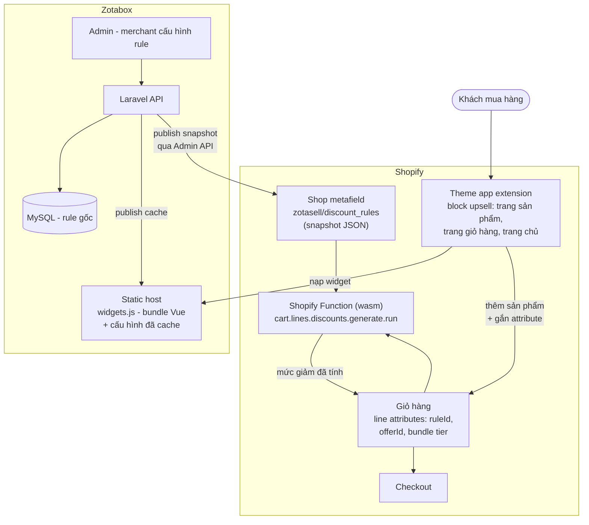

# Wayfinder Holidays - Laravel Practical Exercise
Trần Văn Nam - 15/09/2026

---

## Phần A - Đọc code, rủi ro và thứ tự ưu tiên

### A.1 Các vấn đề phát hiện được

#### Bảo mật

1. Mass assignment ở store()

Chỗ `TourEnquiry::create($request->all())` + `status` nằm trong `$fillable`

Toàn bộ input của khách được đưa thẳng vào `create()`. Vì `status` nằm trong
`$fillable`, khách gửi kèm field này là ghi đè được trạng thái của chính mình.

```
POST /api/enquiries
{"tour_id":1,"name":"Hacker","email":"hacker@example.com","status":"booked"}

HTTP/1.1 201 Created
{"tour_id":1,"name":"Hacker","email":"hacker@example.com","status":"booked","id":2}
```

**Hậu quả:** khách tự đánh dấu mình là đã đặt tour. Sales nhìn dashboard thấy
"booked" nên không gọi lại, khách bị bỏ rơi, và báo cáo doanh số đếm sai.

Phạm vi lỗ hổng giới hạn trong `$fillable` - thử gửi `"id":9999` thì bị bỏ qua,
record vẫn nhận id tự tăng. Nhưng `status` lại nằm trong danh sách đó nên khách mới có thể tự thay đổi `status`

2. Endpoint dashboard không có xác thực

`routes/api.php` - `Route::get('/enquiries', ...)` không gắn middleware nào.

Đây là trang nội bộ của Sales nhưng gọi được từ bất kỳ đâu, không cần đăng nhập.
Response chứa họ tên và email của toàn bộ khách hàng.

```
curl http://127.0.0.1:8000/api/enquiries
HTTP/1.1 200 OK
[{"id":1,"name":"Hacker","email":"hacker@example.com", ...}]
```

**Hậu quả:** toàn bộ danh sách khách hàng bị công khai trên internet.
Đối thủ lấy được thông tin, và đây là dữ liệu cá nhân nên còn là vấn đề
tuân thủ bảo mật thông tin cá nhân khách hàng, không chỉ là thiếu auth.

#### Validation và xử lý lỗi

3. Không validate đầu vào

`store()` không có validation nào. Mọi giá trị đều được lưu.

```
POST /api/enquiries
{"tour_id":1,"name":"Sai Email","email":"khong-phai-email","message":"hoi gia"}

HTTP/1.1 201 Created
{"tour_id":1,"name":"Sai Email","email":"khong-phai-email", ..., "id":4}
```

Tương tự, `phone` nhận được `"goi cho toi nhe"` và `preferred_month` nhận `"99/9999"`.

**Hậu quả:** enquiry có email sai thì Sales không bao giờ liên hệ lại được - khách
tưởng đã gửi thành công và ngồi chờ. Đây là tình huống được mô tả trong Phần C.

4. Trả 500 thay vì 422 khi người dùng nhập sai

Không có tầng validation nên database là nơi duy nhất chặn dữ liệu sai. Khi nó chặn,
exception trở thành lỗi 500.

Bốn trường hợp đều trả 500: body rỗng, thiếu `name`/`email`, `name` và `email` để
trống, và `tour_id` không tồn tại.

```
POST /api/enquiries
{}

HTTP/1.1 500 Internal Server Error
"NOT NULL constraint failed: tour_enquiries.tour_id"
```

**Hậu quả:** với khách hàng, điền thiếu một ô cũng hiện ra "lỗi hệ thống" - họ bỏ đi
chứ không sửa lại form. Với team, log đầy exception nên khi có sự cố thật thì không
lọc ra được giữa đống nhiễu.

5. Chuỗi rỗng bị chuyển thành NULL rồi lỗi ở DB

Middleware `ConvertEmptyStringsToNull` của Laravel đổi `""` thành `null` trước khi
request tới controller. `null` đưa vào cột NOT NULL và bị exception.

```
POST /api/enquiries
{"tour_id":1,"name":"","email":"","message":""}

HTTP/1.1 500 Internal Server Error
"NOT NULL constraint failed: tour_enquiries.name"
```

**Hậu quả:** một ô để trống trên form biến thành lỗi server. Không có validation bắt
trước nên hành vi này nằm ngoài kiểm soát của code hệ thống.

6. `tour_id` chỉ được chặn ở tầng database

```
POST /api/enquiries
{"tour_id":999,"name":"Tour Ma","email":"ma@example.com"}

HTTP/1.1 500 Internal Server Error
"FOREIGN KEY constraint failed"
```

Ứng dụng không kiểm tra gì, hoàn toàn dựa vào foreign key constraint.

**Hậu quả:** SQLite mặc định tắt kiểm tra foreign key ở một số cấu hình. Nếu môi
trường production không bật, record chứa `tour_id` không tồn tại trong bảng `tours` lọt vào - và kết hợp với vấn đề 10 thì
dashboard sập.

7. Không giới hạn độ dài đầu vào

Gửi `name` dài 5000 ký tự: lưu nguyên vẹn, trả 201, dù migration khai
`string('name')` tức VARCHAR(255).

**Hậu quả:** SQLite bỏ qua giới hạn độ dài, MySQL thì không. Cùng một code, dev chạy
bình thường còn production ném lỗi hoặc cắt cụt dữ liệu. Đây là bug chỉ lộ ra sau khi
đã deploy.

#### Toàn vẹn dữ liệu

8. `status` là chuỗi tự do, không ràng buộc giá trị

Migration khai `string('status')->default('new')` kèm comment liệt kê 4 trạng thái,
nhưng không có gì enforce .

```
POST /api/enquiries
{"tour_id":2,"name":"Status La","email":"la@example.com","status":"con_meo"}

HTTP/1.1 201 Created
{"tour_id":2,"name":"Status La","email":"la@example.com","status":"con_meo","id":6}
```

**Hậu quả:** nghiêm trọng hơn cả trường hợp `booked`. Giá trị này không thuộc trạng
thái nào Sales biết, nên lọc dashboard theo 4 trạng thái sẽ không bao giờ hiện nó ra.
Khách biến mất vĩnh viễn mà không có lỗi nào được ghi lại - dữ liệu hỏng im lặng.

9. Chưa có ràng buộc chuyển trạng thái

Không có nơi nào định nghĩa transition nào là hợp lệ.

**Hậu quả:** khi bổ sung chức năng đổi trạng thái, không gì ngăn `closed` quay ngược
về `new`, hay `new` nhảy thẳng `booked` bỏ qua bước liên hệ. Lịch sử xử lý enquiry
mất ý nghĩa và không đối soát được.

10. `$enquiry->tour->name` không kiểm tra null

`index()` truy cập quan hệ mà không phòng trường hợp tour đã bị xoá.

**Hậu quả:** một record trỏ tới tour không còn tồn tại sẽ làm `toàn bộ` endpoint
trả 500. Không phải hỏng một dòng - cả dashboard của Sales sập vì một record.

#### Hiệu năng

11. N+1 query ở `index()`

Vòng lặp gọi `$enquiry->tour` cho từng record mà không eager load.

Đo bằng query log: 5 enquiry thuộc 3 tour khác nhau sinh ra 4 query. Có `with('tour')`
thì query luôn là 2, bất kể số lượng record là bao nhiêu.

**Hậu quả:** 1000 enquiry là 1001 query. Dashboard chậm dần theo thời gian mà không
ai chỉ ra được nguyên nhân, vì code trông vẫn bình thường.

12. `TourEnquiry::all()` không phân trang

Load toàn bộ bảng vào bộ nhớ và dựng object cho từng dòng.

**Hậu quả:** vài chục nghìn enquiry là chạm memory limit, endpoint chết hẳn. Và cũng
không ai đọc hết mười nghìn dòng trong một response.

13. Thiếu index trên `status` và `created_at`

Đây thường là hai cột Sales lọc và sắp xếp nhiều nhất, nhưng migration không tạo index.

**Hậu quả:** chưa ảnh hưởng ở quy mô hiện tại, nhưng sẽ thành vấn đề khi dữ liệu tích
luỹ - và lúc đó thêm index vào bảng lớn sẽ tốn kém hơn nhiều so với làm ngay từ đầu.

#### Khả năng bảo trì

14. Logic dựng response nằm cứng trong controller

Vòng `foreach` map tay từng field trong `index()`.

**Hậu quả:** thêm một field phải sửa controller; không tái sử dụng được ở nơi khác;
không có chỗ nào là nguồn duy nhất định nghĩa hình dạng response.

15. Response thiếu field Sales cần để làm việc

Chỉ trả `id`, `name`, `email`, `tour_name`, `status`.

**Hậu quả:** không có `phone` và `message` thì Sales gọi khách bằng gì và biết khách
hỏi gì; không có `created_at` thì không phân biệt được enquiry mới với cũ.

16. `store()` trả về nguyên model

`response()->json($enquiry, 201)` xuất thẳng mọi thuộc tính của model.

**Hậu quả:** thêm một cột nội bộ vào bảng là API tự động phơi cột đó ra ngoài, không
ai chủ đích làm vậy.

### A.2 Ba việc làm trước tiên

Tiêu chí lựa chọn: ưu tiên việc mà thiệt hại tích luỹ theo thời gian, đơn giản, và làm được
mà không cần hiểu hết hệ thống - vì đây là ngày đầu tiên và tôi chưa đọc phần còn lại
của codebase.

#### 1. Chặn dữ liệu sai ở endpoint nhận form công khai (vấn đề 1, 3, 4, 5, 6, 7, 8)

Thêm FormRequest để validate, bỏ `status` khỏi `$fillable`, và gán `status = 'new'`
cứng trong code thay vì nhận từ input.

Làm đầu tiên vì đây là `luồng ghi`. Mỗi ngày chưa sửa là thêm một ngày dữ liệu hỏng
chảy vào database: email không liên hệ được, trạng thái do khách tự đặt, giá trị lạ
như `con_meo`. Những record đó sẽ phải dọn bằng tay về sau, càng để lâu càng nhiều.

Đây cũng là việc đơn giản nhất trong ba việc: một file FormRequest, một dòng sửa model.
Không đụng tới bất cứ thứ gì đang chạy, không cần biết frontend gọi API thế nào, nên
rủi ro gây lỗi gần như bằng không.

#### 2. Xử lý null và eager load ở `index()` (vấn đề 10, 11)

Thêm `with('tour')` và xử lý trường hợp `tour` là null.

Làm thứ hai vì đây là rủi ro `mất dịch vụ toàn phần`: chỉ cần một enquiry trỏ tới
tour đã xoá là toàn bộ dashboard trả 500, Sales không làm việc được. Nó chưa xảy ra
nên không gấp bằng việc 1, nhưng khi xảy ra thì hỏng ngay lập tức và hỏng hết.

Tiện tay thêm `with('tour')` xử lý luôn N+1 - cùng một dòng code, không tốn thêm
thời gian.

#### 3. Bảo vệ endpoint danh sách enquiry (vấn đề 2)

Thêm xác thực cho `GET /api/enquiries`.

Xét riêng mức độ nghiêm trọng thì đây là vấn đề nặng nhất - dữ liệu cá nhân của toàn
bộ khách hàng đang công khai trên internet. Nhưng tôi xếp thứ ba vì nó là việc duy
nhất trong ba việc có thể làm lỗi thứ đang chạy: nếu dashboard của Sales đang gọi
thẳng endpoint này mà không có cơ chế đăng nhập, thêm auth vào là họ mất công cụ làm
việc ngay trong ngày.

Nên tôi cần hỏi trước xem ai đang gọi endpoint này (xem A.3). Nếu câu trả lời đến sớm
thì việc này lên đầu danh sách; nếu phải chờ, tôi làm hai việc trên trước thay vì
ngồi đợi.

### A.3 Thông tin cần hỏi thêm từ Wayfinder

#### Việc 1 - Thêm validation cho endpoint nhận form công khai

**Phần lớn là không cần.** Không ai phụ thuộc vào việc gửi được dữ liệu sai, nên thêm
validation không làm lỗi thứ gì đang hoạt động. Việc chặn khách tự đặt `status` cũng
vậy

**Một câu cần hỏi:** form công khai trên website hiện gửi lên những field nào, và
field nào Sales coi là bắt buộc?

Tôi cần biết vì nếu đặt `phone` là bắt buộc mà ví dụ form lại không có input đó, thì mọi submission
sẽ bị từ chối - biến một bản sửa lỗi thành sự cố nặng hơn lỗi ban đầu. Migration cho
thấy `phone`, `preferred_month`, `message` đều nullable, nên tôi sẽ mặc định coi ba
field này là tuỳ chọn và chỉ bắt buộc `tour_id`, `name`, `email`. Nhưng đó là suy luận
từ schema, không phải từ yêu cầu nghiệp vụ, nên vẫn nên xác nhận.

Trong lúc chờ trả lời tôi vẫn làm được - mặc định trên đủ an toàn để triển khai ngay,
sửa lại sau nếu Sales nói khác.

#### Việc 2 - Xử lý null và eager load ở `index()`

**Không cần hỏi.** Đây là thay đổi thuần kỹ thuật, không đổi hành vi với dữ liệu hợp
lệ. `with('tour')` chỉ gộp query lại, kết quả trả về y hệt. Xử lý null chỉ ảnh hưởng
tới trường hợp hiện đang làm sập cả endpoint - không thể tệ hơn tình trạng hiện tại.

Có một quyết định nhỏ về sản phẩm: khi tour đã bị xoá thì dashboard nên hiện gì - bỏ
qua record đó, hay hiện kèm ghi chú "tour không còn tồn tại"? Tôi chọn phương án thứ
hai và ghi vào README, vì giấu enquiry đi đồng nghĩa giấu mất một khách hàng thật.
Đây là loại quyết định có thể tự đưa ra rồi xác nhận sau, không đáng chặn công việc
lại để chờ.

#### Việc 3 - Thêm xác thực cho endpoint danh sách enquiry

**Bắt buộc phải hỏi trước, đây là việc duy nhất tôi không tự quyết được.**

Tôi cần biết ba điều:

1. **Ai đang gọi `GET /api/enquiries`?** Trang admin nội bộ, một ứng dụng frontend
   riêng, hay còn công cụ/tích hợp nào khác? Thêm auth mà bỏ sót một consumer là làm
   lỗi công cụ làm việc của họ ngay trong ngày.

2. **Nhân viên Sales hiện đăng nhập bằng cách nào?** Hệ thống đã có bảng users và cơ
   chế đăng nhập chưa, hay trang admin đang không có xác thực gì cả? Câu trả lời quyết
   định đây là việc nửa tiếng (gắn middleware có sẵn) hay việc nhiều ngày (dựng cả
   luồng đăng nhập).

3. **Endpoint này có đang được gọi từ ngoài mạng nội bộ không?** Nếu chỉ chạy trong
   mạng công ty thì mức độ khẩn cấp giảm đáng kể, và có thể chặn tạm bằng IP
   allowlist trong lúc làm giải pháp đúng.

Nếu chưa có ai trả lời được trong ngày, phương án tôi chọn là chặn tạm ở tầng hạ tầng
thay vì sửa code - vừa giảm rủi ro ngay, vừa không lỗi thứ gì, vừa để dành quyết định
thật cho lúc có đủ thông tin.

### A.4 Những việc cố tình không làm trong ngày đầu

Một số việc dưới đây chính là vấn đề tôi đã nêu ở A.1. Nêu ra không có nghĩa là phải
sửa ngay - ngày đầu tiên, việc quan trọng là giảm rủi ro đang có mà không tạo ra rủi
ro mới.

#### 1. Không dọn dữ liệu rác đang có trong database

Hiện trong bảng có những record `status` sai (`booked` do khách tự đặt, `con_meo`)
và email không hợp lệ. Tôi sẽ chặn không cho dữ liệu sai chảy vào tiếp, nhưng không
đụng tới những gì đã nằm sẵn trong đó.

Lý do: đây là thao tác không hoàn tác được, và nó là quyết định nghiệp vụ chứ không
phải kỹ thuật. Một enquiry đang ở `booked` có thể do khách tự đặt, cũng có thể do Sales
đặt đúng quy trình - nhìn vào database tôi không phân biệt được. Đặt hết về `new` là
có nguy cơ xoá mất công việc thật của Sales. Việc này cần Sales ngồi rà cùng, và cần
backup trước khi chạy.

Việc tôi làm trong ngày là viết một truy vấn liệt kê các record đáng ngờ để Sales xem
và tự quyết.

#### 2. Không đổi schema của bảng

Không chuyển `status` sang enum, không thêm index, không đổi kiểu hay độ dài cột -
dù tôi đã nêu những điểm này ở A.1.

Lý do: migration trên bảng có dữ liệu thật là thao tác rủi ro, và ràng buộc mới có thể
thất bại ngay khi chạy vì dữ liệu hiện có đã vi phạm chúng - ví dụ đổi `status` sang
enum trong khi trong bảng đang có giá trị `con_meo`. Phải dọn dữ liệu trước (việc 1),
mà việc 1 thì tôi đã hoãn.

Hơn nữa ràng buộc ở tầng ứng dụng đủ để chặn dữ liệu sai mới. Ràng buộc ở tầng database
là lớp bảo vệ thứ hai - đáng làm, nhưng không phải trong ngày đầu.

#### 3. Không tái cấu trúc kiến trúc

Không tách Service layer, không dựng Repository, không chia lại module

Lý do: tái cấu trúc không giải quyết được bất kỳ vấn đề nào trong ba việc ở A.2. Nó
chỉ làm diff phình to, khiến người review khó nhìn ra đâu là bản sửa lỗi thật, và tăng
khả năng tôi làm hỏng thứ mình chưa hiểu.

Việc này nên làm sau, khi đã có test bao phủ và đã đọc hết codebase.

#### 4. Không sửa hình dạng response của `index()` khi chưa biết ai đang dùng

Tôi thấy response thiếu `phone`, `message`, `created_at` (vấn đề 15) và nên chuyển sang
API Resource (vấn đề 14). Nhưng thêm field thì an toàn, còn đổi hoặc bỏ field
đang có thì có thể làm lỗi frontend đang hiển thị chúng.

Lý do: tôi chưa biết trang admin được viết bằng gì và đọc những field nào. Thay đổi
kiểu này phải đi kèm với frontend thực tế.

---

## Phần B - Triển khai và kiểm thử

### Những thay đổi đã thực hiện

**File mới**

| File | Vai trò |
|---|---|
| `app/Enums/EnquiryStatus.php` | Backed enum định nghĩa 4 trạng thái và các transition hợp lệ - nguồn duy nhất của state machine |
| `app/Http/Requests/StoreEnquiryRequest.php` | Validate dữ liệu gửi từ form công khai |
| `app/Http/Requests/UpdateEnquiryStatusRequest.php` | Validate giá trị `status` gửi lên endpoint đổi trạng thái |
| `app/Http/Resources/EnquiryResource.php` | Định nghĩa hình dạng response, dùng chung cho cả ba endpoint |
| `tests/Feature/EnquiryTest.php` | Hai feature test |
| `database/seeders/TourSeeder.php` | Dữ liệu tour mẫu |

**File sửa**

`app/Models/TourEnquiry.php`
- Bỏ `status` khỏi `$fillable`
- Thêm `casts()` để Eloquent chuyển `status` thành enum

`app/Http/Controllers/EnquiryController.php`
- `index()`: thêm `with('tour')`, `latest()`, `paginate(25)`, trả `EnquiryResource`
- `store()`: nhận `StoreEnquiryRequest`, dùng `validated()`, gán `status` cứng trong code
- Thêm `updateStatus()` cho endpoint PATCH

`routes/api.php`
- Thêm `PATCH /api/enquiries/{enquiry}/status`

**Đối chiếu với các vấn đề ở A.1**

| Vấn đề | Cách xử lý |
|---|---|
| 1 - Mass assignment | Bỏ `status` khỏi `$fillable`, và FormRequest không có rule cho `status` |
| 3 - Không validate | `StoreEnquiryRequest` |
| 4 - 500 thay vì 422 | Validation chặn trước khi chạm database |
| 5 - Chuỗi rỗng | `required` bắt trước khi `ConvertEmptyStringsToNull` gây hại |
| 6 - `tour_id` chỉ chặn ở DB | Rule `exists:tours,id` |
| 7 - Độ dài đầu vào | Rule `max` trên mọi trường chuỗi |
| 8 - `status` tự do | Enum + `casts()` + `Rule::enum()` |
| 9 - Không ràng buộc transition | `EnquiryStatus::canTransitionTo()` |
| 10 - `tour->name` null | `$this->tour?->name` trong Resource |
| 11 - N+1 | `with('tour')` |
| 12 - Không phân trang | `paginate(25)` |
| 14, 15, 16 - Response | `EnquiryResource` dùng chung, bổ sung `phone`, `message`, `created_at` |

Vấn đề 2 (thiếu xác thực) và 13 (thiếu index) cố tình chưa làm - lý do ở A.3 và A.4.

**Hai lớp bảo vệ cho `status`.** Bỏ khỏi `$fillable` và không khai rule trong
FormRequest. Một lớp hỏng thì vẫn còn lớp kia. Vì `$fillable` không còn `status`,
`store()` phải gán qua property (`$enquiry->status = ...`) thay vì truyền vào
`create()` - nếu truyền vào mảng thì Eloquent sẽ âm thầm bỏ qua và trạng thái ban đầu
sẽ phụ thuộc giá trị default của cột, không phải vào code.

**Kết quả kiểm chứng**

| Request | Trước | Sau |
|---|---|---|
| POST hợp lệ | 201 | 201, `status` = `new` |
| POST kèm `"status":"booked"` | 201, lưu `booked` | 201, `status` vẫn `new` |
| POST email sai định dạng | 201 | 422 |
| POST `tour_id` không tồn tại | 500 | 422 |
| POST body rỗng | 500 | 422, kèm danh sách field thiếu |
| PATCH `new → contacted` | - | 200, trả enquiry đã cập nhật |
| PATCH `contacted → new` | - | 422, DB không đổi |
| PATCH `booked → contacted` | - | 422, DB không đổi |
| PATCH `closed → *` | - | 422, báo đây là trạng thái cuối |
| PATCH `"status":"con_meo"` | - | 422 |
| PATCH id không tồn tại | - | 404 |

### Giả định khi triển khai

**Field bắt buộc.** `tour_id`, `name`, `email` bắt buộc; `phone`, `preferred_month`,
`message` tuỳ chọn. Suy ra từ migration (ba cột sau là nullable), không phải từ yêu
cầu nghiệp vụ. Như đã nêu ở A.3, đây là điểm cần Sales xác nhận.

**Độ chặt của email.** Dùng `email:rfc`, không dùng `dns` - rule `dns` truy vấn DNS
thật nên làm test chậm và phụ thuộc mạng. Đổi lại, email đúng cú pháp nhưng không tồn
tại vẫn lọt; xác minh thật sự cần cơ chế gửi thư xác nhận, không phải validation.

**Giới hạn độ dài.** `name`, `email` 255 khớp VARCHAR trong migration; `message` 2000
và `phone` 30 là con số tôi tự chọn. Không dựa vào database để enforce, vì SQLite và
MySQL hành xử khác nhau (vấn đề 7 ở A.1).

**Chuyển sang chính trạng thái hiện tại bị từ chối.** `booked → booked` trả 422. Đề
liệt kê đúng 4 transition hợp lệ và yêu cầu mọi thứ khác bị từ chối; tự chuyển về
chính nó không nằm trong danh sách đó.

**`closed` là trạng thái cuối.** Không có transition nào đi ra từ `closed`, kể cả quay
lại `contacted`. Suy trực tiếp từ danh sách 4 transition của đề.

**Phân trang làm đổi hình dạng response.** `GET /api/enquiries` giờ trả object có
`data`, `links`, `meta` thay vì mảng phẳng. Đây là breaking change với frontend đang
dùng. Tôi vẫn làm vì đề yêu cầu xử lý endpoint này và vì nguy cơ hết bộ nhớ là thật,
nhưng ngoài thực tế đây là thay đổi phải thống nhất với người làm frontend trước -
đúng như đã nêu ở A.4 mục 4.

**Endpoint PATCH chưa có xác thực.** `authorize()` trả `true`. Đây là endpoint nội bộ
của Sales nên lẽ ra phải có auth, nhưng như đã nêu ở A.3, tôi chưa biết hệ thống đăng
nhập hiện tại hoạt động thế nào. Khi có thông tin thì chỉ cần gắn middleware vào route
và sửa `authorize()`.

**Chưa dọn dữ liệu cũ.** Các record đang có `status` sai vẫn nguyên trạng - lý do ở
A.4 mục 1.

### Hai test đã viết và lý do chọn

**1. `test_status_sent_by_the_public_form_is_ignored`**

Gửi form kèm `"status":"booked"`, khẳng định response trả `new` và trong database cũng
là `new`.

Chọn vì đây là lỗ hổng duy nhất **hỏng mà không phát ra tiếng động**. Request vẫn trả
201, dữ liệu vẫn vào database, không có lỗi nào được ghi - nhìn từ bên ngoài mọi thứ
bình thường, chỉ có báo cáo doanh số là sai. Nó cũng là lỗ hổng dễ mở lại nhất: chỉ
cần ai đó thêm `'status'` vào `$fillable` cho tiện là hở ngay, mà thay đổi đó trông
hoàn toàn vô hại khi review.

**2. `test_an_invalid_status_transition_is_rejected_and_leaves_the_record_unchanged`**

Dựng enquiry ở `booked`, thử chuyển sang `contacted`, khẳng định trả 422 **và** đọc
lại từ database thấy vẫn là `booked`.

Chọn vì vế thứ hai quan trọng ngang vế thứ nhất. Một cách viết khác - lưu trước rồi
mới kiểm tra, hoặc kiểm tra rồi quên rollback - vẫn trả về đúng mã lỗi nhưng đã làm
hỏng dữ liệu. Test chỉ kiểm tra status code sẽ pass trong cả hai trường hợp. Dùng
`fresh()` để đọc lại từ database chứ không tin object đang giữ trong bộ nhớ.

Hai test này bảo vệ đúng hai điều mà hỏng thì không ai biết. Những hành vi khác -
email sai bị chặn, `tour_id` không tồn tại bị chặn - nếu hỏng thì lộ ra ngay ở lần thử
đầu tiên, nên ít cần một test canh giữ hơn.

---

## Phần C - Thư trả lời CEO

Tour enquiries - tình hình hiện tại và các bước tiếp theo

Chào anh/chị,

Tôi đã nắm được thông tin và đang xử lý ngay. Tôi hiểu mức độ
nghiêm trọng: nếu có khách gửi yêu cầu mà không ai liên hệ lại trong ba ngày, đó là
thông tin của khách đã biến mất, không chỉ là một lỗi kỹ thuật.

Việc đầu tiên tôi làm sáng nay là kiểm tra xem các yêu cầu đó có được lưu vào hệ thống
hay không. Câu trả lời quyết định mọi thứ còn lại, và nó chia tình huống thành hai
hướng rất khác nhau:

- Nếu dữ liệu vẫn còn, chúng ta chưa mất thông tin của khách nào. Tôi sẽ trích danh sách toàn bộ
  yêu cầu ba ngày qua và gửi cho Sales trong sáng nay để gọi lại ngay hôm nay. Vấn đề
  khi đó nằm ở khâu thông báo, không phải ở form.
- Nếu dữ liệu không được lưu, tôi sẽ ưu tiên khôi phục những gì còn lấy lại được từ
  log máy chủ trước, rồi mới sửa nguyên nhân.

Tôi chưa biết nguyên nhân nên chưa thể hứa thời điểm sửa xong. Điều tôi cam kết được
là trước giờ nghỉ trưa nay tôi sẽ báo cáo lại với kết luận về nguyên nhân và một mốc thời gian
cụ thể.

Hai điều tôi muốn nói thêm: tôi mới join dự án được hai tuần và chưa đọc hết hệ thống, và
đồng nghiệp - người hiểu module này - đang nghỉ dài hạn. Nên tôi sẽ đi chậm hơn
bình thường ở khâu xác định nguyên nhân, nhưng sẽ không để việc đó làm chậm khâu liên
hệ lại với khách.

Nếu anh/chị muốn trao đổi trực tiếp, tôi có thể gọi bất cứ lúc nào trong sáng nay.

Trân trọng,
Trần Văn Nam

---

## Phần D - Kinh nghiệm và tự đánh giá

### D.1 Một hệ thống tôi từng xây dựng

**Zotasell** - ứng dụng upsell/cross-sell cho merchant trên Shopify.

**1. Hệ thống làm gì**

Merchant cấu hình các rule khuyến mãi (mua X tặng Y, bundle, giảm theo số lượng) trong
trang admin của ứng dụng. Ngoài storefront, các widget gợi ý sản phẩm hiển thị trong
trang sản phẩm, trang giỏ và trang chủ; khi khách thêm hàng vào giỏ, mức giảm giá tương
ứng được áp ngay trong giỏ và giữ nguyên tới checkout.

**2. Phần tôi chịu trách nhiệm**

Gần như toàn bộ và trong đó có mảng discount rule - từ nơi merchant tạo rule ở admin, tầng đồng bộ rule sang
Shopify, logic tính giảm giá chạy trong Shopify Function, cho tới các block storefront
hiển thị offer và ghi thông tin rule vào dòng giỏ hàng.

**3. Quyết định kỹ thuật quan trọng nhất**

Hai đường đi được tách bạch có chủ đích. Đường hiển thị phụ thuộc vào hạ tầng của
chúng tôi: theme block nạp bundle widget từ static host. Nếu hạ tầng đó gặp sự cố,
widget không hiện - khách vẫn mua hàng bình thường, chỉ là không thấy gợi ý.
Đường tính tiền thì không: rule đã nằm sẵn trong metafield, Function chạy trên hạ
tầng Shopify và không gọi ra ngoài. Nghĩa là hỏng phía chúng tôi thì mất doanh thu
tăng thêm, nhưng không bao giờ làm sai giá hay chặn một đơn hàng.

**4. Vấn đề khó nhất khi đã chạy production**

Xung đột giữa chiết khấu do ứng dụng sinh ra và chiết khấu merchant tự tạo trong
Shopify. Merchant chạy một đợt giảm giá của riêng họ, hoặc khách nhập mã giảm giá, và
kết quả trong giỏ không như bất kỳ bên nào mong đợi - có trường hợp ưu đãi upsell biến
mất, có trường hợp hai mức giảm cùng áp và tổng tiền thấp hơn mức merchant chấp nhận.

Khó vì ba lý do. Thứ nhất, nó không tái hiện được bằng một giỏ hàng đơn giản: phải đúng
tổ hợp rule của chúng tôi, chiết khấu của merchant, và thiết lập cho phép chồng nhau
của từng cái. Thứ hai, quy tắc quyết định cái nào thắng nằm ở phía Shopify, không nằm
trong code của tôi - tôi không thể đọc code để suy ra, chỉ có thể dựng từng trường hợp
rồi quan sát kết quả. Thứ ba, merchant báo lại là "giá sai", một mô tả đúng nhưng không
giúp khoanh vùng được gì, vì với họ mọi thứ chỉ là một con số trong giỏ.

Hướng tôi chọn là phân tách phạm vi thay vì cố dàn xếp: chiết khấu của ứng dụng chỉ
đăng ký đúng một loại (sản phẩm), và Function thoát ngay khi lần chạy không thuộc loại
đó. Việc chiết khấu của chúng tôi có chồng được với chiết khấu merchant hay không thì
để Shopify quyết theo thiết lập của họ - chúng tôi không ghi đè. Xung đột giữa các rule
của chính ứng dụng thì xử lý riêng ở một tầng khác, bằng thứ tự ưu tiên cộng với bước
loại trùng để hai rule không cùng giảm giá trên một dòng giỏ hàng.

**5. Một quyết định sẽ làm khác đi**

Ở giai đoạn đầu, tài liệu của Shopify về Function chưa đầy đủ, nên tôi tự gọi API và thử
tay từng biến thể payload để tìm ra cấu trúc nào được chấp nhận. Việc đó tốn rất nhiều
thời gian cho một việc mang tính dò tìm. Nếu làm lại, tôi sẽ để AI sinh và chạy một loạt
trường hợp cùng lúc để dựng nhanh bản đồ những payload hợp lệ, rồi mới tự tay xác minh
những trường hợp quan trọng.

**Sơ đồ kiến trúc**



### D.2 Tự đánh giá bài nộp

**Phần tôi tự tin nhất:** logic chuyển trạng thái. State machine nằm gọn trong một enum
duy nhất, việc kiểm tra xảy ra trước khi ghi database, và có test khẳng định bản ghi
không đổi khi transition bị từ chối. Tôi đã chạy đủ các tổ hợp - cả bốn transition hợp
lệ, các chiều ngược, trạng thái cuối, giá trị không hợp lệ và id không tồn tại.

**Phần tôi kém tự tin nhất:** không phải phần đã viết, mà là phần cố tình bỏ lại.
Endpoint danh sách enquiry và endpoint đổi trạng thái vẫn chưa có xác thực - đây là lỗ
hổng nghiêm trọng nhất tôi tìm được ở A.1, và tôi kết thúc bài tập mà nó vẫn còn nguyên.
Tôi cho rằng đó là lựa chọn đúng khi chưa biết hệ thống đăng nhập hiện tại hoạt động thế
nào, nhưng nó vẫn là thứ khiến tôi không thoải mái.

Ở mức nhỏ hơn: tôi không chắc bốn giả định về field bắt buộc có khớp với form thật của
Wayfinder không, và việc chuyển endpoint danh sách sang phân trang là thay đổi mà ngoài
đời tôi sẽ không tự quyết một mình.

**Nếu có thêm hai tiếng:**

1. **Xác thực cho hai endpoint nội bộ** (khoảng 45 phút, giả sử hệ thống đã có sẵn cơ
   chế đăng nhập). Đây là việc duy nhất trong danh sách mà bỏ qua thì có hậu quả thật
   ngay lúc này.
2. **Bổ sung test** (khoảng 40 phút): khẳng định dữ liệu sai không tạo record, khẳng
   định endpoint danh sách không sinh N+1, và phủ đủ bốn transition hợp lệ. Hai test
   hiện tại bảo vệ hai chỗ dễ hỏng nhất, nhưng còn mỏng.
3. **Truy vấn liệt kê dữ liệu bất thường** (khoảng 20 phút) để Sales rà những enquiry
   đang có trạng thái sai - không tự sửa, chỉ đưa ra danh sách, đúng như đã nêu ở A.4.
4. **Ghi log khi transition bị từ chối** (khoảng 15 phút). Hiện tại lỗi chỉ trả về cho
   người gọi rồi biến mất. Nếu Sales liên tục thử một chuyển đổi không được phép, đó là
   tín hiệu quy trình thực tế khác với bốn transition trong đề - và không ai biết được
   điều đó.

### D.3 Năm câu hỏi của tôi

1. **Về vận hành khi có sự cố** Khi hệ thống có vấn đề ngoài giờ làm việc thì ai xử lý, và phát hiện bằng cách nào?
    Trong tình huống ở Phần C, sự cố kéo dài ba ngày trước khi có người biết. Tôi muốn hiểu
    hiện tại công ty phát hiện lỗi qua kênh nào - giám sát tự động, hay chờ khách và Sales
    báo lại - và kỳ vọng với tôi ngoài giờ hành chính là gì.

2. **Quy trình đưa code lên production hiện tại là gì, và quay lui bằng cách nào?** Đây
   là câu tôi quan tâm nhất. Không có đường lùi thì mọi thay đổi đều đắt, và người mới
   sẽ rất ngại đụng vào bất cứ thứ gì.

3. **Quy mô thật** Mỗi tháng có khoảng bao nhiêu enquiry, và bao nhiêu phần trăm thành đơn? Con số này
    đổi hẳn thứ tự ưu tiên kỹ thuật. Vài trăm enquiry một tháng thì hiệu năng chưa phải
    vấn đề; vài chục nghìn thì những điểm tôi nêu ở phần hiệu năng cần làm sớm hơn nhiều.

4. **Sáu tháng tới Wayfinder muốn đạt được gì?** Câu trả lời quyết định thứ tự ưu tiên.
   Chuẩn bị mở thêm thị trường thì khác hẳn với giữ nguyên quy mô và giảm lỗi vận hành.

5. **Khi Sales cần gấp một việc còn kỹ thuật thấy cần làm chậm lại, ai là người quyết?**
   Tình huống ở Phần C là một ví dụ. Tôi muốn biết công ty xử lý loại xung đột đó ra
   sao, vì nó ảnh hưởng tới công việc hàng ngày nhiều hơn bất kỳ lựa chọn công nghệ nào.